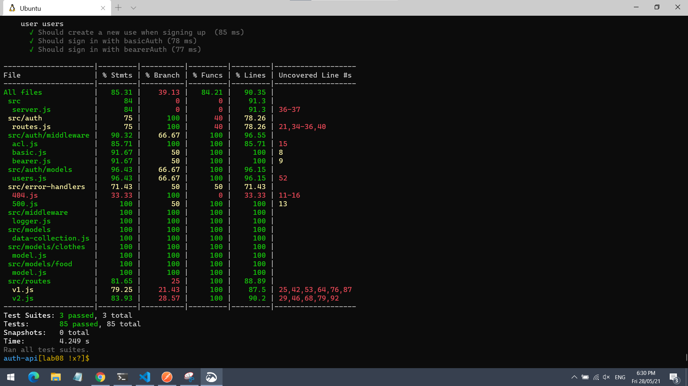
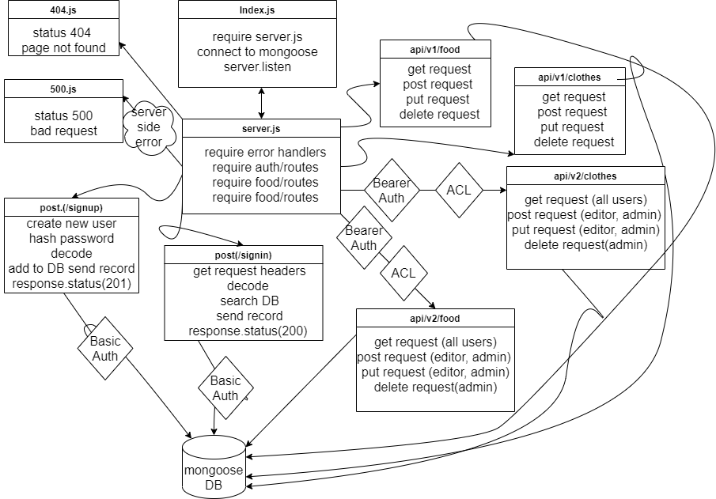

# auth-api

[Pull-Request](https://github.com/yasmeenokh/auth-api/pull/2)
[Actions](https://github.com/yasmeenokh/auth-api/actions)
[Repo-Link](https://github.com/yasmeenokh/auth-api/actions)

## Install
Clone the repository from GitHub
Run the command npm i dotenv express jest supertest mongoose morgan @code-fellows/supergoose, base-64, bcrypt, jsonwebtoken supertest to install dependencies
create .env file with PORT variable
## Test
Run the command npm test to test and verify the server and the logger middleware  are working.
Run the command npm run test for testing .

## Test image : 

## Run
Start the server using nodemon/npm start
Visit http://localhost:PORT at the PORT number you've assigned in your .env

## Routes
* https://yasmeen-auth-api.herokuapp.com/bad
* https://yasmeen-auth-api.herokuapp.com/foo
* https://yasmeen-auth-api.herokuapp.com/singin
* https://yasmeen-auth-api.herokuapp.com/signup
* https://yasmeen-auth-api.herokuapp.com/api/v1/food
* https://yasmeen-auth-api.herokuapp.com/api/v1/clothes
* https://yasmeen-auth-api.herokuapp.com/api/v2/clothes
* https://yasmeen-auth-api.herokuapp.com/api/v2/food

## UML Diagram 
